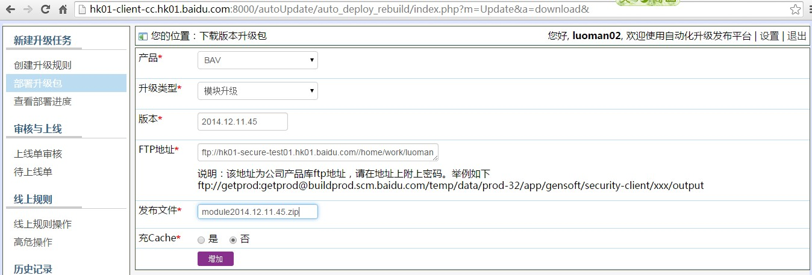
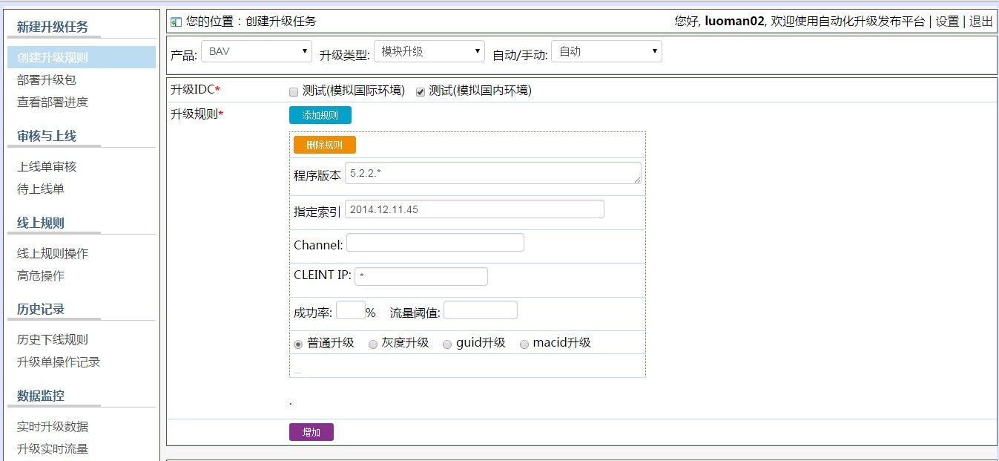

Date: 2013-11-27
Title: pelican install
Tags: pelican
Category: Pelican
Slug: pelican-install

:date: 2010-10-03 10:20
:tags: thats, awesome
:category: yeah
:slug: my-super-post
:author: Alexis Metaireau
:summary: Short version for index and feeds
-----
1. 将模块升级文件上传到10.240.36.36上，通常选用luoman这个文件夹，rz -be
2. 部署升级包地址： [http://hk01-client-cc.hk01.baidu.com:8000/autoUpdate/auto\\_deploy\\_rebuild/index.php?m=Op&a=onlineRules&](http://hk01-client-cc.hk01.baidu.com:8000/autoUpdate/auto_deploy_rebuild/index.php?m=Op&a=onlineRules&)  
部署升级包 
3. 创建升级规整 BAV 模块设计 自动 测试国内 
4. 上线单审核
5. 待上线单
6. 可在线上规整操作 查看 解冲突
7. 配置host  
10.240.36.36 update.sd.baidu.com  
10.240.36.36 update.bav.baidu.com  
10.240.36.36 update.security.baidu.co.th  
10.240.36.36 download.sd.baidu.com  
10.240.36.36 download.antivirus.baidu.com  
10.240.36.36 download.bav.baidu.com  
10.240.36.36 download.security.baidu.co.th  
10.240.36.36 updown.bav.baidu.com

8. BavUpdater.exe -svc\_no\_ui 服务启动的升级，一般使用该方式
9. BavUpdater.exe -no_ui 第一次安装后的升级
10. BavUpdater.exe -with_ui 界面升级
11. BavUpdater.exe -avira 小红伞升级
12.  BavUpdater.exe -tools\_update\_query 小工具升级  
  
  
  

12/11/2014 5:45:44 PM 
